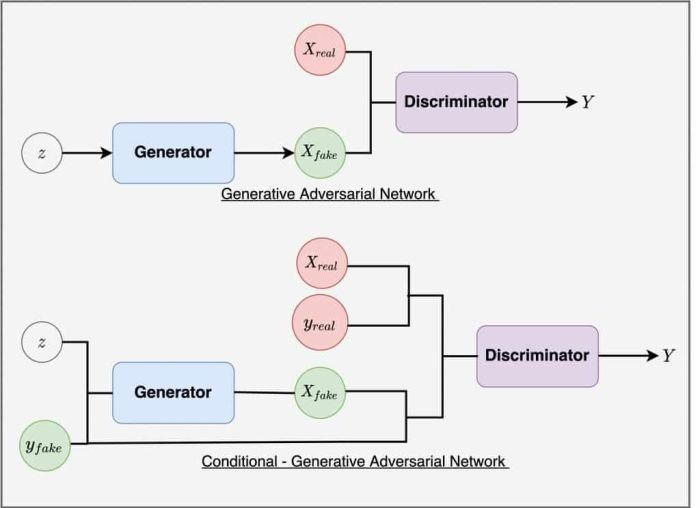
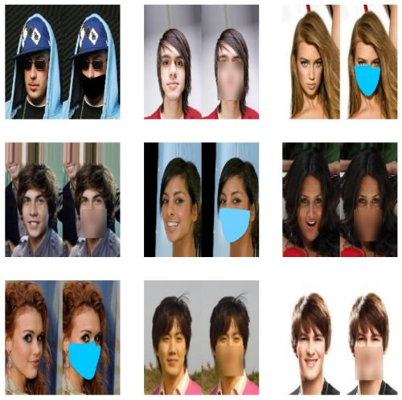
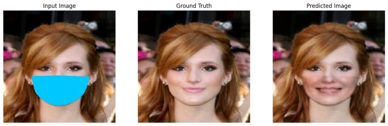
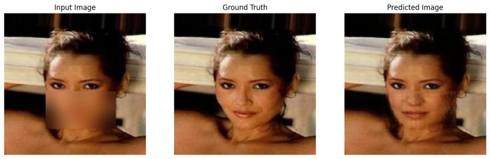
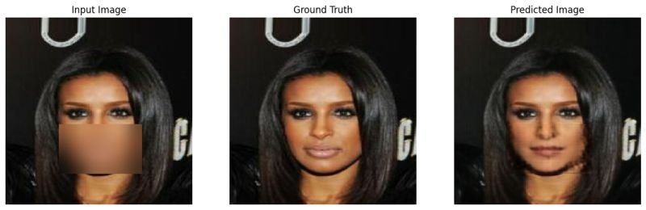

<h1 align="center">Facial Reconstruction using Conditional Generative Adversarial Network</h1>

<div align="center">

[](https://www.python.org)
[](https://www.tensorflow.org/)
[](https://scikit-learn.org/stable/index.html)

[]()
[](https://arxiv.org/abs/1611.04076)

</div>

<h4 align="center">Reconstructing occluded facial images using CelebA dataset</h4>

<br />


<p>Credit: LearnOpenCV</p>

<h2>Table of Contents</h2>

- [Overview](#overview)
- [Dataset](#dataset)
- [Model Training](#training)
- [Model Evaluation](#evaluation)
- [Result](#result)
- [Credit](#credit)

<a id="overview"></a>
<h2>Overview</h2>
<p align="justify">
The goal of this project is to reconstruct occluded facial images using a Conditional Generative Adversarial Network (CGAN). First off, occluded images were generated by applying different types of occlusions, such as nose masks of different colors and Gaussian blur, to the CelebA dataset. A Conditional Generative Adversarial Network (CGAN) model was then trained using the occluded images. The generator model used in the CGAN is U-Net, while the discriminator model is PatchGAN. The trained CGAN model was evaluated using structural similarity index (SSIM) and peak signal-to-noise ratio (PSNR) to measure the similarity and quality of the reconstructed images. This project is based on the Pix2Pix paper, which explores conditional adversarial networks for image-to-image translation tasks.
</p>

<a id="dataset"></a>
<h2>Dataset</h2>
<p align="justify">
The primary dataset used in this project is the <a href="https://www.kaggle.com/datasets/jessicali9530/celeba-dataset/data">CelebA dataset</a>. The CelebA dataset is a large-scale face attributes dataset with more than 200K celebrity images, each with 40 attribute annotations. The images in this dataset cover large pose variations and background clutter.</p>



<p align="justify">What I did was to generate different types of occlusions for 20,000 images in the CelebA dataset. The occlusions include: nose mask of different color and the Gaussian blur. The occlusion also include partial and full occlusion of the face. The occluded images were used as input to the Conditional Generative Adversarial Network (CGAN) to generate the reconstructed images.</p>

<a id="training"></a>
<h2>Training</h2>
<p align="justify">
The generator model used is U-Net while the discriminator model used is PatchGAN. During training, the generator and discriminator models are trained in an adversarial manner. The generator aims to generate reconstructed images that are indistinguishable from the original images, while the discriminator aims to correctly classify between real and generated images. This adversarial training process helps the generator improve its ability to generate high-quality reconstructed images.
</p>

<a id="evaluation"></a>
<h2>Evaluation</h2>
<p align="justify">
The trained model was evaluated using structural similarity index (SSIM) and peak signal-to-noise ratio (PSNR). The SSIM is a method used to evaluate the similarity between two images. The SSIM value ranges from -1 to 1, where 1 means the two images are identical. The PSNR is a method used to evaluate the quality of the reconstructed image. The PSNR value ranges from 0 to infinity, where 0 means the two images are completely different and infinity means the two images are identical. The SSIM and PSNR values for the reconstructed images are shown below. The SSIM value is 0.8534142374992371 and the PSNR value is 22.33269500732422. The SSIM value is close to 1 which means the reconstructed image is very similar to the original image. The PSNR value is 22.33 which means the reconstructed image is of good quality. 
</p>

<a id="result"></a>
<h2>Result</h2>
<p align="justify">
The result of the facial reconstruction using the Conditional Generative Adversarial Network (CGAN) is shown below. The first image is the occluded image, the second image is the original image and the third image is the reconstructed image. The reconstructed image is generated by the CGAN model. Even though there are some variations in the results such as facial emotion i.e. some people might be smiling in the original image but not in the reconstructed image, the model was able to reconstruct the occluded images to a large extent. Training the CGAN model on Kaggle GPU took a huge amount of time even for a very small epoch, around 5 epochs I think. If you want a better result, then you can consider training for larger epochs.</p>
</p>







<a id="credit"></a>
<h2>Credit</h2>
<h3>Pix2Pix paper</h3>
<h4>Image-to-Image Translation with Conditional Adversarial Networks by Phillip Isola, Jun-Yan Zhu, Tinghui Zhou, Alexei A. Efros</h4>
<strong>Abstract</strong>
<p align="justify">
We investigate conditional adversarial networks as a general-purpose solution to image-to-image translation problems. These networks not only learn the mapping from input image to output image, but also learn a loss function to train this mapping. This makes it possible to apply the same generic approach to problems that traditionally would require very different loss formulations. We demonstrate that this approach is effective at synthesizing photos from label maps, reconstructing objects from edge maps, and colorizing images, among other tasks. Indeed, since the release of the pix2pix software associated with this paper, a large number of internet users (many of them artists) have posted their own experiments with our system, further demonstrating its wide applicability and ease of adoption without the need for parameter tweaking. As a community, we no longer hand-engineer our mapping functions, and this work suggests we can achieve reasonable results without hand-engineering our loss functions either.
</p>


```bibtex
@misc{isola2018imagetoimage,
      title={Image-to-Image Translation with Conditional Adversarial Networks}, 
      author={Phillip Isola and Jun-Yan Zhu and Tinghui Zhou and Alexei A. Efros},
      year={2018},
      eprint={1611.07004},
      archivePrefix={arXiv},
      primaryClass={cs.CV}
}
